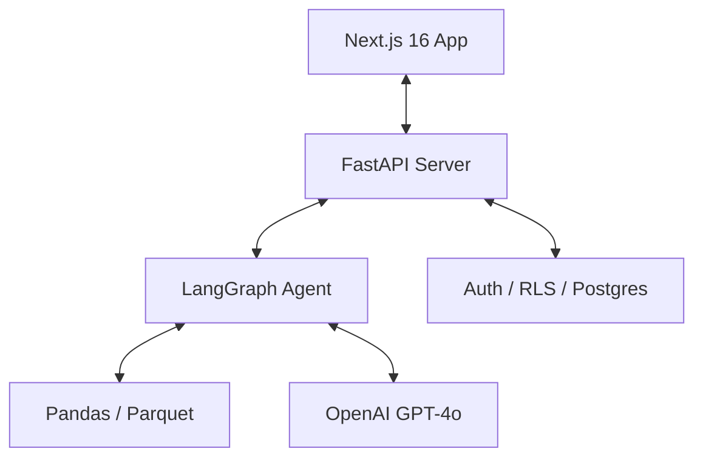

# SpokesBot: AI-Powered Digital Marketing Analytics

SpokesBot is a sophisticated, multi-tenant digital marketing assistant that transforms raw campaign performance data into actionable executive insights. Built with a high-performance **FastAPI** backend and a modern **Next.js** frontend, it leverages **LangGraph**-based agents to provide deep-dive analysis through a streaming conversational interface.

---

## 🏗️ Architecture

### Core Technology Stack

| Layer | Technologies |
| :--- | :--- |
| **Frontend** | Next.js 16 (App Router), React 19, Tailwind CSS 4, Shadcn/UI, Recharts |
| **Backend** | FastAPI, Python 3.12, LangGraph, LangChain, Pandas |
| **Database/Auth** | Supabase (PostgreSQL, RLS, Edge Storage) |
| **AI/ML** | OpenAI GPT-4o, Reflexion Critic Pattern |
| **Testing** | Playwright (E2E), Pytest (Backend), Jest (Frontend) |

---

## ✨ Key Features

- **Multi-Tenant Isolation**: Row-Level Security (RLS) ensures that client data is strictly siloed by organization.
- **Proactive Insights**: Automated analysis of high-performing vs. underperforming campaigns using Reflexion-pattern agents.
- **Conversational Analytics**: Streamed AI chat responses that allow users to drill down into dataset-specific metrics.
- **Admin Managed**: Centralized admin portal for agency managers to handle client organizations and dataset uploads.
- **High-Performance Ingestion**: CSV-to-Parquet pipeline for rapid querying of millions of rows using Pandas.

---

## 🚀 Getting Started

### Prerequisites

- Python 3.12+
- Node.js 20+
- Supabase Project (with logical RLS schema)
- OpenAI API Key

### Backend Setup

1. `cd backend`
2. `python3 -m venv venv && source venv/bin/activate`
3. `pip install -r requirements.txt`
4. Copy `.env.example` to `.env` and fill in credentials.
5. `uvicorn app.main:app --reload`

### Frontend Setup

1. `cd frontend`
2. `npm install`
3. `npm run dev`

---

## 🔒 Security & Safety

- **Data Privacy**: No client data is ever used to "train" models. All analysis is performed on-the-fly against specific organization datasets.
- **Reflexion Critic Pattern**: A dual-agent system where a "Critic" validates every number generated by the AI assistant against raw tool output before it reaches the user.
- **Brevity & Precision**: The system is engineered to provide concise, summarized insights, avoiding the "AI verbosity" common in generic assistants.

---

## 🗺️ Roadmap

Check the [IMPLEMENTATION_ROADMAP.md](./IMPLEMENTATION_ROADMAP.md) for detailed progress on the construction of the V1 MVP.

---

© 2026 Spokes Digital. All rights reserved.
